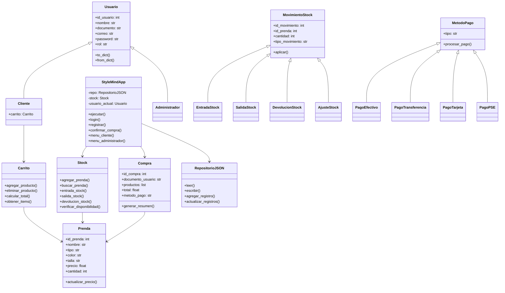

# 👕 StyleMind

Sistema de gestión para una tienda de ropa, desarrollado en **Python** con Programación Orientada a Objetos y menú interactivo por consola.

Proyecto académico de **Algoritmos y Programación 1** — corte 3.

---

## 📌 Descripción

StyleMind es una aplicación de consola que simula el ciclo completo de una tienda de prendas: registro e inicio de sesión de usuarios, catálogo de productos, carrito de compras, checkout con múltiples métodos de pago y control de inventario con trazabilidad de movimientos.

El sistema separa las responsabilidades en clases independientes, aplica **herencia** y **polimorfismo** para modelar las entidades del dominio, y persiste toda la información en archivos **JSON** sin necesidad de un servidor de base de datos.

---

## ✨ Funcionalidades

### Módulo de usuarios
- Registro de clientes con validación de documento, correo y contraseña
- Inicio de sesión por documento + contraseña
- Recuperación de contraseña
- Roles diferenciados: **Cliente** y **Administrador**

### Módulo de catálogo e inventario
- Catálogo de prendas con atributos (tipo, color, talla, precio, cantidad)
- Alta de nuevas prendas
- Entrada de mercancía
- Devolución de producto
- Ajuste manual de inventario
- Verificación de disponibilidad antes de operar

### Módulo de ventas
- Carrito de compras con modificación de cantidades
- Cálculo automático del total
- Checkout con **4 métodos de pago**
- Historial de compras por cliente y general

### Módulo de trazabilidad
- Registro histórico de todo movimiento de stock
- Identificador único por movimiento

---

## 💳 Métodos de pago

Implementados mediante herencia y polimorfismo, todos comparten la misma interfaz `procesar_pago()`:

| Método | Clase |
|---|---|
| Efectivo | `PagoEfectivo` |
| Transferencia bancaria | `PagoTransferencia` |
| Tarjeta de crédito | `PagoTarjeta` |
| PSE | `PagoPSE` |

---

## 🏗️ Arquitectura



---

## 🧠 Conceptos de POO aplicados

| Concepto | Dónde se aplica |
|---|---|
| **Abstracción** | `MovimientoStock` define el comportamiento común; las subclases implementan `aplicar()` |
| **Herencia** | `Cliente` y `Administrador` heredan de `Usuario` |
| **Polimorfismo** | Cada método de pago y cada movimiento de stock ejecuta su propia lógica bajo la misma interfaz |
| **Encapsulamiento** | Atributos con guiones bajo y acceso controlado por métodos |
| **Composición** | `StyleMindApp` compone `Stock`, `Carrito` y `RepositorioJSON` |
| **Responsabilidad única** | Un archivo por clase, cada una con un único propósito |

---

## 🚀 Cómo ejecutarlo

No requiere instalar dependencias: el proyecto usa **solo la librería estándar de Python**.

```bash
python StyleMind.py
```

**Requisito mínimo:** Python 3.6 o superior.

### Usuario de prueba

El sistema carga un administrador por defecto:

| Campo | Valor |
|---|---|
| Documento | `0000000000` |
| Contraseña | `admin123` |

También puedes registrar un cliente nuevo desde el menú principal.

---

## 📂 Estructura del proyecto

```
APPSTYLEMIND/
├── StyleMind.py            # Punto de entrada
├── app.py                  # Lógica principal y menús
├── usuario.py              # Usuario, Cliente, Administrador
├── prenda.py               # Entidad Prenda
├── stock.py                # Gestión de inventario
├── movimiento_stock.py     # Entrada, Salida, Devolución, Ajuste
├── carrito.py              # Carrito de compras
├── compra.py               # Registro de compras
├── pago.py                 # Métodos de pago
├── repositorio_json.py     # Capa de persistencia
├── validaciones.py         # Validación de entradas
├── datos_iniciales.py      # Datos semilla del catálogo
├── datos/
│   ├── prendas.json        # Catálogo de productos
│   └── usuarios.json       # Usuarios registrados
└── README.md
```

---

## 🛠️ Tecnologías

- **Python 3** — lenguaje principal
- **Programación Orientada a Objetos** — herencia, polimorfismo, abstracción, encapsulamiento
- **JSON** — persistencia de datos sin servidor externo
- **Módulo `os`** — manipulación de rutas y directorios
- **Git** — control de versiones

---

## 👤 Autor

**Juan Sampayo** — [github.com/juanksrt](https://github.com/juanksrt)

---

## 📄 Licencia

Proyecto académico con fines educativos.
